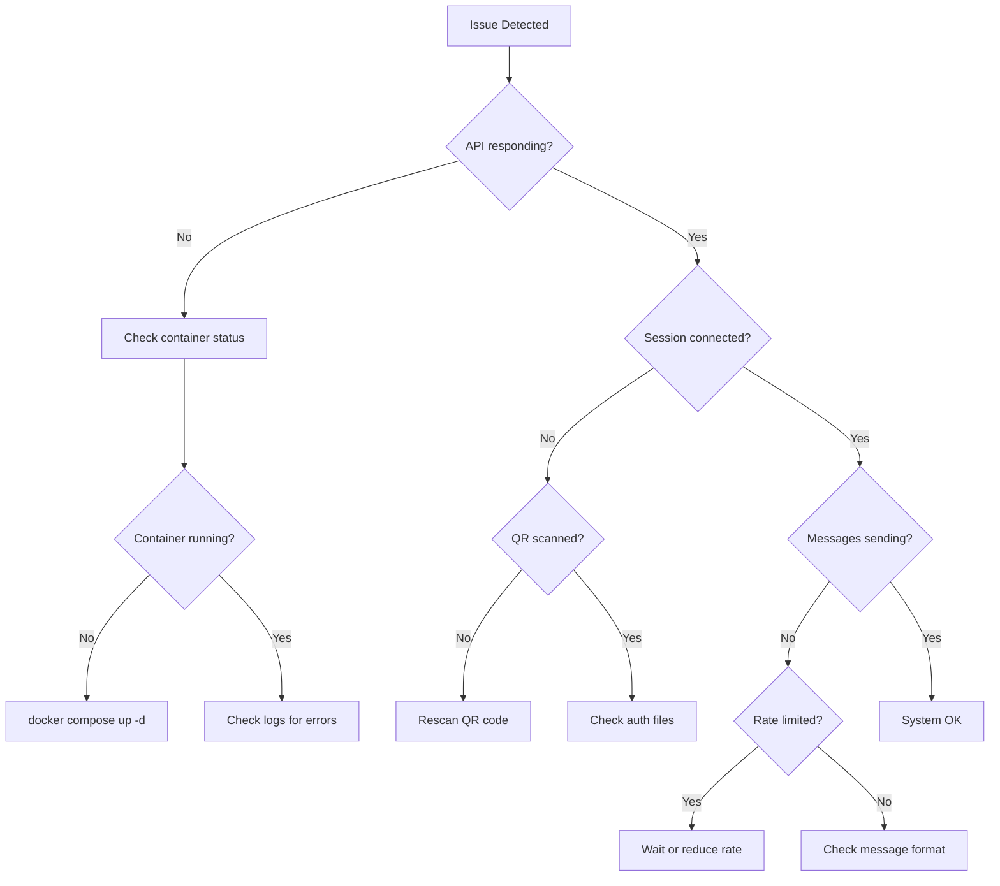
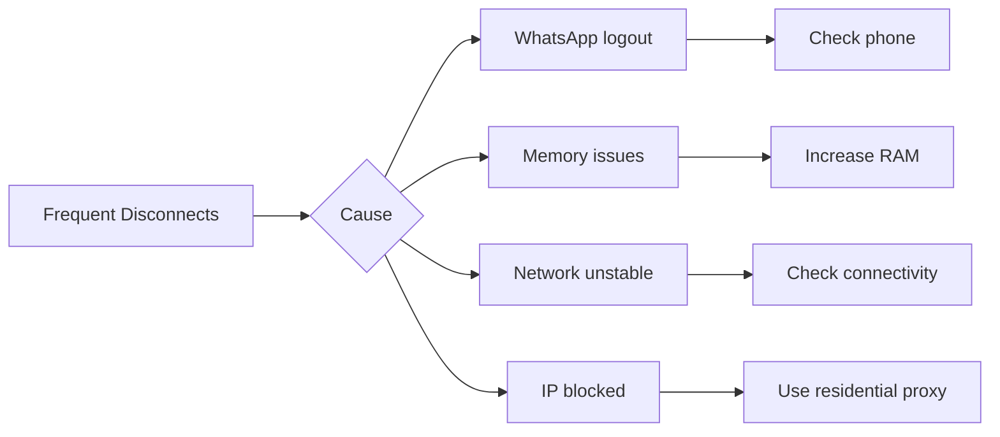
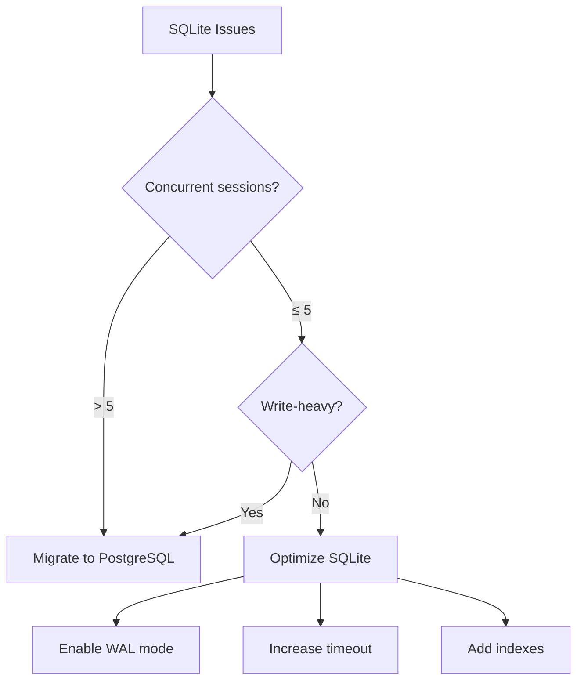

# 12 - Troubleshooting & FAQ

## 12.1 Quick Diagnostics

### Health Check Commands

```bash
# Basic health check
curl http://localhost:2785/api/health

# Readiness (DB) check
curl -H "X-API-Key: $API_KEY" \
  http://localhost:2785/api/health/ready

# Check specific session
curl -H "X-API-Key: $API_KEY" \
  http://localhost:2785/api/sessions/{sessionId}

# Check all services
docker compose ps
docker compose logs --tail=50

# System resources
docker stats openwa
```

### Diagnostic Flowchart



## 12.2 Podman Compatibility

### Issue: `FileNotFoundError` / Docker socket missing

**Symptoms:**

```text
docker.errors.DockerException: Error while fetching server API version:
  ('Connection aborted.', FileNotFoundError(2, 'No such file or directory'))
```

**Cause:** The system uses Podman (not Docker Engine). Podman's rootless socket is inactive by default.

**Fix:**

```bash
systemctl --user start podman.socket
systemctl --user enable podman.socket
export DOCKER_HOST=unix:///run/user/$(id -u)/podman/podman.sock
```

Add the `export` to `~/.bashrc` to make it permanent.

---

### Issue: `short-name did not resolve to an alias`

**Symptoms:**

```text
Error: creating build container: short-name "nginx:alpine" did not resolve to an alias
and no unqualified-search registries are defined
```

**Cause:** Podman rootless mode does not fall back to Docker Hub for unqualified image names.

**Fix:** All `FROM` directives in the `Dockerfile` must use fully-qualified names:

```dockerfile
FROM docker.io/node:22-slim
```

---

### Issue: Healthcheck always `unhealthy` on Node 22 + Podman

**Symptoms:** Container starts successfully but stays `unhealthy`; logs show:

```text
SyntaxError: Unexpected end of input
at evalTypeScript (node:internal/process/execution:256:22)
```

**Cause:** Node 22 routes `node -e` through its TypeScript evaluator which rejects arrow-function
syntax. Podman also splits quoted shell commands on whitespace, truncating the `-e` argument.

**Fix:** Use `curl` for the healthcheck instead of `node -e`:

```dockerfile
HEALTHCHECK --interval=30s --timeout=10s --start-period=30s --retries=3 \
    CMD curl -f http://localhost:2785/api/health || exit 1
```

```yaml
# docker-compose.dev.yml
healthcheck:
  test: ['CMD', 'curl', '-f', 'http://localhost:2785/api/health']
```

Ensure `curl` is installed in the production stage:

```dockerfile
RUN apt-get install -y ... curl ...
```

---

## 12.3 Connection Issues

### Issue: Container Won't Start

**Symptoms:**
- `docker compose up` fails
- Container exits immediately
- "Port already in use" error

**Solutions:**

```bash
# Check what's using the port
lsof -i :2785
# or
netstat -tlnp | grep 3000

# Kill process using port
kill -9 $(lsof -t -i:2785)

# Check Docker logs
docker compose logs openwa

# Common fixes
docker compose down --volumes  # Reset volumes
docker system prune -f         # Clean up Docker
docker compose pull            # Get latest image
docker compose up -d
```

### Issue: Dashboard Renders a Blank White Screen

**Symptoms:**
- The API is healthy (`curl http://<host>:2785/api/health` returns `200`) but the dashboard is blank
- The startup log says `🖥️ Dashboard: serving bundled UI at …` — the UI *is* being served
- The browser console shows script-loading errors; DevTools → Network shows the `/assets/*.js`
  requests going to `https://` even though you opened the page over `http://`
- You reach the instance directly over plain HTTP (a host:port allocation, a private network, a
  panel like Pterodactyl) rather than through a TLS-terminating reverse proxy

**Cause:** In production OpenWA sends the CSP `upgrade-insecure-requests` directive, which tells the
browser to upgrade every sub-resource fetch to HTTPS. That is correct behind a TLS proxy. Over plain
HTTP the browser upgrades the dashboard's own script requests to `https://`, the non-TLS server
cannot answer them, no JavaScript runs, and React never mounts — a blank page. The failure happens
in the browser, so the server log stays clean.

**Solution:**

```bash
# Opt out, then fully restart the container (not just reload)
CSP_UPGRADE_INSECURE_REQUESTS=false

# Confirm it actually reached the process
docker compose exec openwa printenv NODE_ENV CSP_UPGRADE_INSECURE_REQUESTS
```

A production boot that serves the dashboard with the opt-out unset prints a warning naming this
setting. If you are behind a TLS proxy, ignore that warning — the directive is doing its job.

> The alternative is to front OpenWA with a TLS-terminating reverse proxy (the shipped
> `docker-compose.yml` topology), which serves the dashboard over HTTPS and makes the upgrade a
> no-op.

### Issue: Session Won't Connect

**Symptoms:**
- QR code generated but session stays "INITIALIZING"
- "TIMEOUT" status after scanning QR
- Session stuck in "CONNECTING" state

**Diagnostic:**

```bash
# Check session status
curl -H "X-API-Key: $API_KEY" \
  http://localhost:2785/api/sessions/{sessionId}

# Check WhatsApp engine logs
docker compose logs openwa 2>&1 | grep -i "whatsapp\|puppeteer\|browser"

# Check auth folder
ls -la ./data/.wwebjs_auth/session-{sessionId}/
```

**Solutions:**

| Cause | Solution |
|-------|----------|
| Expired QR | Generate new QR (valid 60 seconds) |
| Auth folder corrupted | Delete and rescan |
| Browser crash | Restart container |
| Network issues | Check firewall/proxy |
| WhatsApp blocked | Set a per-session proxy (`proxyUrl`) |

```bash
# Clear auth and restart
rm -rf ./data/.wwebjs_auth/session-{sessionId}
docker compose restart openwa
```

Proxy egress (if WhatsApp is blocked on your network) is configured **per session** via the
`proxyUrl`/`proxyType` fields on `POST /api/sessions` — it is **not** an environment variable, and an
unreachable proxy silently blocks the WhatsApp WebSocket (see the *No QR code appears, or `/start`
returns `504`* entry below).

### Issue: No QR code appears, or `POST /api/sessions/:id/start` returns `504`

**Symptoms:**
- `POST /api/sessions/:id/start` returns `504 Gateway Timeout`
  (`WhatsApp Web authentication timed out...`)
- No QR code is ever produced — `GET /api/sessions/:id/qr` never has one
- Engine log shows `Session engine failed: auth timeout` after ~30s

**Cause:** The session was created with a `proxyUrl` that doesn't resolve to a real, reachable proxy
(e.g. the `http://proxy.example.com:8080` placeholder copied from an example). The engine launches
Chromium pinned to that proxy, the WhatsApp WebSocket can never connect, no QR is produced, and the
auth poll times out.

**Fix:** Don't set a proxy unless your network actually requires one. Recreate the session without
`proxyUrl`, or set it to a real, reachable proxy server:

```bash
# No proxy needed (the common case):
curl -X POST "$BASE/api/sessions" -H "X-API-Key: $API_KEY" -H "Content-Type: application/json" \
  -d '{ "name": "my-bot" }'
```

> ℹ️ Proxy egress for the `whatsapp-web.js` engine is configured **per session** via the
> `proxyUrl`/`proxyType` fields on `POST /api/sessions` — not via environment variables.

### Issue: Session stuck at `authenticating`, never reaches `ready`

> **Engine:** This issue applies to the `whatsapp-web.js` engine only. If you are using `ENGINE_TYPE=baileys`, skip this section.

**Symptoms:** After scanning the QR the phone links the device, but the session stays at
`authenticating` indefinitely and never becomes `ready`. `GET /sessions/:id/qr` returns 400 while
stuck. Often seen on ARM64 (e.g. Raspberry Pi) after upgrading to v0.2.x.

**Cause:** whatsapp-web.js auto-selects a WhatsApp Web client version, and an incompatible version
stalls the post-link sync. (If you also see `chrome_crashpad_handler: --database is required` *and the
session never starts at all*, that is a different problem — see "Session fails to launch …" below.)

**Fix:** OpenWA reconciles a missed `ready` event when WhatsApp Web is connected, the injected
runtime is available, and whatsapp-web.js has populated the linked account identity. If your
environment still hits a WA-Web compatibility hang, pin a known-good WA-Web version with
`WWEBJS_WEB_VERSION`:

```bash
# Optional workaround:
WWEBJS_WEB_VERSION=2.3000.1040641150-alpha
```

Restart the container after changing it. Browse newer versions at
[wppconnect-team/wa-version](https://github.com/wppconnect-team/wa-version) (the `html/` folder). Set
`WWEBJS_WEB_VERSION=latest`, `auto`, or `off` (or leave it unset) to use whatsapp-web.js
auto-version behavior.

### Issue: QR generation times out on slow first boot (WSL2 / low-resource)

> **Engine:** This issue applies to the `whatsapp-web.js` engine only. If you are using `ENGINE_TYPE=baileys`, skip this section.

**Symptoms:** On the first launch the session never produces a QR code and fails after ~30 seconds,
often inside WSL2 or a resource-constrained container while WhatsApp Web is still loading.

**Cause:** whatsapp-web.js waits a fixed 30000ms for WhatsApp Web to finish its initial load before
generating the QR. On a slow first boot that window can expire before the page is ready.

**Fix:** raise the boot/inject wait (milliseconds) with `WWEBJS_AUTH_TIMEOUT_MS`:

```bash
# Allow up to 2 minutes for the first-boot init wait:
WWEBJS_AUTH_TIMEOUT_MS=120000
```

Restart the container after setting it. Leave it unset to keep the default (30000ms).

### Issue: Session fails to launch with `chrome_crashpad_handler: --database is required`

> **Engine:** This issue applies to the `whatsapp-web.js` engine only (Chromium/Puppeteer-based). It does not affect `ENGINE_TYPE=baileys`.

**Symptoms:** The session never starts; the engine log shows `Failed to launch the browser process` with
`chrome_crashpad_handler: --database is required`, and the host kernel log shows a Chromium
`trap int3` / `Trace/breakpoint trap (core dumped)`. Seen on hardened, `read_only` containers.

**Cause:** Chromium resolves its home directory from the passwd entry (glibc `getpwuid()`) and **ignores
`$HOME`**. The non-root `openwa` user has no home dir, so Chromium tries to use `/home/openwa`, which does
not exist on the read-only rootfs — and aborts at launch. (Setting `HOME=` does **not** help, and
`--crash-dumps-dir` is a no-op for the crashpad database on Debian/Ubuntu system Chromium.)

**Fix:** Give Chromium writable, pre-created config/cache dirs via `XDG_CONFIG_HOME` / `XDG_CACHE_HOME`.
The bundled image and `docker-compose.yml` already do this (the entrypoint creates them on the tmpfs `/tmp`,
owned by `openwa`). If you run a custom container, ensure both are set to a writable, existing path:

```bash
XDG_CONFIG_HOME=/tmp/.config
XDG_CACHE_HOME=/tmp/.cache
# and create them owned by the runtime user before launch:
#   mkdir -p /tmp/.config /tmp/.cache && chown <user> /tmp/.config /tmp/.cache
```

On a `read_only` rootfs you **must** also mount a writable tmpfs/emptyDir at `/tmp` (compose:
`tmpfs: [/tmp]`; k8s: an `emptyDir` at `/tmp`) — otherwise the entrypoint cannot create these dirs and
will exit at startup with a clear `FATAL:` message rather than crash-looping later.

Do **not** work around this by dropping `--no-sandbox` security hardening or using `seccomp:unconfined`
(confirmed not to help, and it widens the attack surface).

### Issue: Session fails to launch with `Failed to launch the browser process: Code: null`

> **Engine:** This issue applies to the `whatsapp-web.js` engine only (Chromium/Puppeteer-based). It does not affect `ENGINE_TYPE=baileys`.

**Symptoms:** The session fails within a few seconds of clicking **Start**; no QR code is ever produced. The
session's `lastError` and the container log both show:

```text
Failed to launch the browser process:  Code: null
```

often accompanied by a wall of `ERROR:dbus/bus.cc` / `crashpad ... /sys/devices/system/cpu/...` lines.
**Those dbus/crashpad lines are non-fatal noise** that headless Chromium always prints inside a container —
ignore them. The actual signal is `Code: null`, which means the browser process was killed during startup
before it could report an exit code. The cause is *not* in the log — it's a host/container resource limit,
and there are three distinct ones. Diagnose which one before changing anything:

**Cause A — per-container PID limit hit (most common under multi-session).**
whatsapp-web.js runs a full Chromium instance per session, and Chromium is multi-process (browser + renderer
+ GPU + zygote + utilities); WhatsApp Web is itself process-heavy (service workers, iframes). A handful of
concurrent sessions can approach the container's `pids_limit`, and the next session's Chromium gets killed
mid-spawn when a `fork()` returns `EAGAIN`. This is silent in the log.

*Diagnose:* watch the PIDS column while you click **Start**:

```bash
docker stats openwa-api   # watch the PIDS column — does it climb toward the limit right before the failure?
```

*Fix:* raise the ceiling. The bundled `docker-compose.yml` exposes it as `OPENWA_PIDS_LIMIT` (default `2048`,
which fits ~8-10 sessions with startup-spike headroom):

```bash
OPENWA_PIDS_LIMIT=4096   # in your .env, then docker compose up -d
```

Do **not** set `-1` (unlimited) — the PID ceiling is a fork-bomb guard and should stay finite. Baileys
(no Chromium) uses only a handful of PIDs regardless, so raising this is a no-op there.

**Cause B — out-of-memory kill.**
The container's `mem_limit` (or the host VM, e.g. Docker Desktop on macOS/Windows) ran out of RAM while
Chromium was starting. The OOM killer sends `SIGKILL`, which Puppeteer reports as `Code: null`.

*Diagnose:* check the host kernel log for an OOM kill:

```bash
dmesg -T | grep -i "killed process"          # Linux host
# Docker Desktop: check the VM via the app, or nudge OPENWA_MEM_LIMIT up and retry
```

*Fix:* raise the ceiling (`OPENWA_MEM_LIMIT=4g` in your `.env`, or Docker Desktop → Settings → Resources →
Memory for the VM).

**Cause C — the XDG/crashpad home-dir crash.**
If `Code: null` is accompanied by `chrome_crashpad_handler: --database is required`, that is a different,
specific failure (Chromium can't resolve its home directory on a read-only rootfs) — see the entry
immediately above this one for the fix. The bundled image already handles this; it only resurfaces on a
custom container that drops the `XDG_CONFIG_HOME` / `XDG_CACHE_HOME` setup or the writable `/tmp` tmpfs.

**Cause D — Debian 12 OS Chromium SIGTRAP in non-root Pods.**
If `Code: null` happens on Kubernetes, and the host kernel logs or `dmesg` shows `Trace/breakpoint trap (core dumped)` with exit code 133, the underlying Debian 12 OS `chromium` package has crashed due to strict non-root or seccomp constraints (even with `--no-zygote` or `Unconfined` seccomp). 
*Fix:* On amd64, do not use the `chromium` package from Debian's `apt` — it SIGTRAPs under strict non-root/seccomp. Instead, download Chrome for Testing via Puppeteer during the Docker build (`./node_modules/.bin/puppeteer browsers install 'chrome@146.0.7680.31'`) and point `PUPPETEER_EXECUTABLE_PATH` to it. (Chrome for Testing has no linux-arm64 build, so arm64 keeps Debian's `chromium`, which ships a native arm64 binary.) The official `Dockerfile` implements this mixed approach.

**Quick triage:** run `docker stats openwa-api`, click **Start**, and watch which resource spikes toward its
limit the instant before the failure — that tells you A vs B. If neither moves and you see the crashpad
`--database` line, it's C. If running in K8s as non-root with the Debian `chromium` package, it is likely D.

### Issue: `Execution context was destroyed` on the first start after an upgrade

> **Engine:** This issue applies to the `whatsapp-web.js` engine only (Chromium/Puppeteer-based). It does not affect `ENGINE_TYPE=baileys`.

**Symptoms:** A `whatsapp-web.js` session that was already authenticated fails within seconds of
**Start** after upgrading OpenWA — no QR is produced — and the session's `lastError` / container log
show:

```text
Protocol error (Runtime.callFunctionOn): Execution context was destroyed.
```

**Cause:** The session's persistent browser profile (`<SESSION_DATA_PATH>/session-<name>`, created by
whatsapp-web.js's `LocalAuth`) was built with a different Chromium/Chrome binary than the one the new
image runs. A browser profile carries binary-bound state (page caches, GPU shader caches, IndexedDB /
Local Storage version markers) that is not safely portable across Chromium major versions or binary
flavours; loading the stale profile destroys the page context during `Client.inject()`. The dominant
trigger today is the **v0.8.12** amd64 switch from Debian's `chromium` package to Chrome for Testing
(#663), but the same symptom can follow any future change to the bundled browser binary. The error
reads like a Puppeteer bug and gives no hint that the profile is the cause — the adapter now logs an
advisory when it detects this error.

**Fix:** delete the affected session's profile dir and start the session again to scan a new QR. The
profile cannot be salvaged — clearing only the cache subdirs (`Cache`, `GPUCache`, `Code Cache`, …) is
**not** enough, the taint is deeper than the caches — so a one-time re-authentication is required.

The profile dir is named after the session **name**, while the REST API addresses a session by its
**id** (a UUID) — so the two placeholders below are different values:

```bash
docker exec openwa-api rm -rf /app/data/sessions/session-<name>
# then POST /sessions/<id>/force-kill and POST /sessions/<id>/start (the session's UUID id), and scan the new QR
```

Re-creating the session (`DELETE /sessions/<id>`) also purges its profile dir; create it again and
scan. Messages are unaffected — they live in the database, not the browser profile — so nothing is lost
except the WhatsApp pairing, which must be re-scanned.

### Issue: Frequent Disconnections

**Symptoms:**
- Session disconnects every few hours
- "DISCONNECTED" status in logs
- Need to rescan QR frequently

**Causes & Solutions:**



**Configuration fixes:**

```env
# Increase reconnection attempts
WA_RECONNECT_INTERVAL=5000
WA_MAX_RECONNECT_ATTEMPTS=10

# Enable session persistence
WA_PERSISTENT_SESSION=true

# Increase timeouts
WA_AUTH_TIMEOUT=120000
WA_QR_TIMEOUT=60000
```

## 12.3 Messaging Issues

### Issue: Messages Not Sending

**Symptoms:**
- API returns 200 but message not delivered
- "Message send failed" errors
- Messages stuck in queue

**Diagnostic:**

```bash
# Check message history
curl -H "X-API-Key: $API_KEY" \
  http://localhost:2785/api/sessions/{sessionId}/messages/{chatId}/history

# Check queue / infra status (ADMIN)
curl -H "X-API-Key: $API_KEY" \
  http://localhost:2785/api/infra/status

# Rate limiting is global (throttler, env-configured) — there is no per-session rate-limit endpoint
```

**Common Causes:**

| Cause | Symptom | Solution |
|-------|---------|----------|
| Invalid phone number | 400 error | Format: `628123456789@c.us` |
| Rate limited | 429 error | Reduce sending rate |
| Session disconnected | 503 error | Reconnect session |
| Media too large | 413 error | Compress or reduce size |
| Number not on WhatsApp | Message fails silently | Verify number first |

**Phone Number Validation:**

```typescript
// Correct format
const validFormats = [
  '628123456789@c.us',      // Indonesian
  '14155552671@c.us',       // US
  '628123456789-1234@g.us', // Group ID
];

// API to check if number exists
// GET /api/sessions/{id}/contacts/check/{number}
curl -H "X-API-Key: $API_KEY" \
  "http://localhost:2785/api/sessions/default/contacts/check/628123456789"
```

### Issue: Media Upload Fails

**Symptoms:**
- "File too large" error
- "Unsupported media type" error
- Upload timeout

**Solutions:**

```bash
# Check file size limit
echo $MAX_FILE_SIZE  # Default: 16MB

# Increase limit in docker-compose.yml
environment:
  - MAX_FILE_SIZE=64mb
  - UPLOAD_TIMEOUT=60000

# Supported formats
# Images: jpg, jpeg, png, gif, webp
# Videos: mp4, 3gp
# Audio: mp3, ogg, wav, opus
# Documents: pdf, doc, docx, xls, xlsx, ppt, pptx
```

**Media Compression:**

```bash
# Send an image (by URL or base64)
curl -X POST http://localhost:2785/api/sessions/{id}/messages/send-image \
  -H "X-API-Key: $API_KEY" \
  -H "Content-Type: application/json" \
  -d '{
    "chatId": "628123456789@c.us",
    "url": "https://example.com/image.jpg"
  }'
```

### Issue: Webhook Not Receiving Messages

**Symptoms:**
- Messages received but webhook not triggered
- Webhook URL returns errors
- Duplicate webhook calls

**Diagnostic:**

```bash
# Check webhook configuration
curl -H "X-API-Key: $API_KEY" \
  http://localhost:2785/api/sessions/{sessionId}/webhooks

# No webhook-delivery log API — check the server logs / audit trail instead
docker compose logs openwa 2>&1 | grep -i webhook

# Test webhook endpoint
curl -X POST http://your-webhook-url \
  -H "Content-Type: application/json" \
  -d '{"test": true}'
```

**Solutions:**

```yaml
# Webhook configuration
webhook:
  url: https://your-server.com/webhook
  events:
    - message.received
    - message.ack
    - session.status
  retry:
    max_attempts: 3
    delay: 5000
  timeout: 30000
  headers:
    Authorization: "Bearer your-token"
```

## 12.4 Performance Issues

### Issue: High Memory Usage

**Symptoms:**
- Container using > 1GB RAM per session
- OOM (Out of Memory) kills
- Slow response times

**Diagnostic:**

```bash
# Check memory usage
docker stats openwa --no-stream

# Check process memory (Prometheus text; read openwa_process_resident_memory_bytes)
curl -H "Authorization: Bearer $METRICS_TOKEN" \
  http://localhost:2785/api/metrics

# Expected: ~300-500MB per session (whatsapp-web.js / Chromium engine)
# With ENGINE_TYPE=baileys the footprint is significantly lower (no Chromium)
```

**Solutions:**

```yaml
# docker-compose.yml - Set memory limits
services:
  openwa:
    deploy:
      resources:
        limits:
          memory: 2G
        reservations:
          memory: 512M
    environment:
      # Optimize Puppeteer (whatsapp-web.js engine only)
      - PUPPETEER_ARGS=--disable-dev-shm-usage,--disable-gpu,--no-sandbox
      # Limit cache
      - WA_CACHE_SIZE=1000
      # Disable media caching
      - CACHE_MEDIA=false
```

**Memory Optimization Tips:**

| Optimization | Impact | Trade-off |
|--------------|--------|-----------|
| Disable media cache | -30% RAM | Slower media re-send |
| Reduce message history | -20% RAM | Less searchable history |
| Headless Chrome flags | -15% RAM (wwebjs only) | None |
| Limit concurrent sessions | Linear | Fewer sessions |

### Issue: Slow API Response

**Symptoms:**
- API takes > 1 second to respond
- Timeout errors
- High latency for simple operations

**Diagnostic:**

```bash
# Measure API response time
time curl http://localhost:2785/api/health

# Check database readiness (no dedicated DB metric)
curl http://localhost:2785/api/health/ready

# Check queue / infra status (ADMIN)
curl -H "X-API-Key: $API_KEY" \
  http://localhost:2785/api/infra/status
```

**Solutions:**

```sql
-- SQLite: Add indexes
CREATE INDEX IF NOT EXISTS idx_messages_session_id ON messages(session_id);
CREATE INDEX IF NOT EXISTS idx_messages_created_at ON messages(created_at);
CREATE INDEX IF NOT EXISTS idx_contacts_session_id ON contacts(session_id);

-- PostgreSQL: Analyze tables
ANALYZE sessions;
ANALYZE messages;
ANALYZE contacts;
```

```yaml
# Enable connection pooling (PostgreSQL)
database:
  type: postgresql
  pool:
    min: 5
    max: 20
    idle_timeout: 30000

# Enable Redis caching
cache:
  adapter: redis
  ttl: 3600
```

## 12.5 Database Issues

### Issue: Database Locked (SQLite)

**Symptoms:**
- "SQLITE_BUSY" errors
- "database is locked" messages
- Write operations failing

**Solutions:**

```bash
# Check for long-running queries
sqlite3 ./data/openwa.db ".timeout 30000"

# Increase timeout in configuration
DATABASE_SQLITE_BUSY_TIMEOUT=30000

# Check WAL mode
sqlite3 ./data/openwa.db "PRAGMA journal_mode;"
# Should return: wal

# Enable WAL mode
sqlite3 ./data/openwa.db "PRAGMA journal_mode=WAL;"
```

**When to Migrate to PostgreSQL:**



### Issue: Database Migration Failed

**Symptoms:**
- "Migration failed" errors
- Schema mismatch
- Missing tables

**Solutions:**

```bash
# Show migration status (executed + pending)
npm run migration:show

# Run all pending migrations
npm run migration:run

# Rollback last migration
npm run migration:revert

# Schema is managed by migrations (there is no schema:sync)
# The auth/audit DB has parallel :main variants, e.g.:
npm run migration:run:main
```

**PostgreSQL crash-loop on boot after upgrade** — if logs show `column "id" is of type uuid but default expression is of type character varying` or `foreign key constraint ... cannot be implemented ... incompatible types: character varying and uuid`, the deployment was previously bootstrapped with `DATABASE_SYNCHRONIZE=true` (native `uuid` columns vs the migrations' `varchar`). A guard migration converts the columns automatically on the next boot; for large `messages` tables, run the migration against the stopped app (`npm run migration:run`) during a maintenance window. See [14.5 / 14.9 — PostgreSQL crash-loop after upgrading a `DATABASE_SYNCHRONIZE=true` deployment](./14-migration-guide.md). `DATABASE_SYNCHRONIZE=true` is unsupported on PostgreSQL for production.

## 12.6 Docker Issues

### Issue: Volume Permissions

**Symptoms:**
- "Permission denied" errors
- Can't write to data directory
- Auth files not persisting

**Solutions:**

```bash
# Check current permissions
ls -la ./data/

# Fix ownership (use your user ID)
sudo chown -R $(id -u):$(id -g) ./data/

# Or use Docker's user mapping
# docker-compose.yml
services:
  openwa:
    user: "1000:1000"  # Your UID:GID
```

### Issue: Container Networking

**Symptoms:**
- Can't connect to database container
- Webhook calls fail from container
- "Connection refused" errors

**Solutions:**

```yaml
# docker-compose.yml - Ensure proper networking
services:
  openwa:
    networks:
      - openwa-network
    extra_hosts:
      - "host.docker.internal:host-gateway"  # Access host from container

  postgres:
    networks:
      - openwa-network

networks:
  openwa-network:
    driver: bridge
```

```bash
# Test connectivity from container
docker exec openwa ping postgres
docker exec openwa curl http://host.docker.internal:8080
```

## 12.7 Frequently Asked Questions

### General Questions

**Q: Is OpenWA safe to use?**
> A: OpenWA uses unofficial WhatsApp Web API. While we implement best practices to avoid detection, there's inherent risk of account restrictions. We recommend:
> - Use dedicated phone number (not personal)
> - Don't send spam or bulk unsolicited messages
> - Follow WhatsApp's Terms of Service
> - Implement rate limiting

**Q: How many sessions can I run?**
> A: Depends on your server resources and the engine in use. With the default `whatsapp-web.js` engine (Chromium-based), each session uses ~300-500MB RAM:
> - 2GB RAM: 3-5 sessions
> - 4GB RAM: 8-10 sessions
> - 8GB RAM: 15-20 sessions
>
> With `ENGINE_TYPE=baileys` (browser-free), RAM per session is significantly lower — you can run more sessions on the same hardware. Exact figures depend on message volume and group membership.

**Q: Can I use WhatsApp Business account?**
> A: Yes, OpenWA works with both personal and WhatsApp Business accounts. Note that WhatsApp Business API (official Meta API) is different and not supported.

**Q: How to avoid getting banned?**
> Best practices:
> - Don't send > 200 messages/day for new numbers
> - Gradually increase volume
> - Avoid identical messages to multiple recipients
> - Use random delays between messages
> - Don't send to numbers that haven't messaged you first

### Technical Questions

**Q: How to send messages to groups?**
```bash
# Get group list
curl -H "X-API-Key: $API_KEY" \
  http://localhost:2785/api/sessions/{id}/groups

# Send to group
curl -X POST http://localhost:2785/api/sessions/{id}/messages/send-text \
  -H "X-API-Key: $API_KEY" \
  -H "Content-Type: application/json" \
  -d '{
    "chatId": "120363123456789@g.us",
    "text": "Hello group!"
  }'
```

**Q: How to handle message replies?**
```bash
# Reply to specific message
curl -X POST http://localhost:2785/api/sessions/{id}/messages/reply \
  -H "X-API-Key: $API_KEY" \
  -H "Content-Type: application/json" \
  -d '{
    "chatId": "628123456789@c.us",
    "quotedMessageId": "ABC123_DEF456",
    "text": "This is a reply"
  }'
```

**Q: How to use with n8n?**
> See [n8n Integration Guide](./22-n8n-integration.md). Quick setup:
> 1. Add HTTP Request node
> 2. Set URL: `http://openwa:2785/api/sessions/{id}/messages/send-text`
> 3. Add header: `X-API-Key: your-key`
> 4. Configure webhook trigger for incoming messages

**Q: How to run behind reverse proxy (nginx)?**
```nginx
# nginx.conf
server {
    listen 443 ssl;
    server_name api.example.com;

    location / {
        proxy_pass http://localhost:2785;
        proxy_http_version 1.1;
        proxy_set_header Upgrade $http_upgrade;
        proxy_set_header Connection 'upgrade';
        proxy_set_header Host $host;
        proxy_set_header X-Real-IP $remote_addr;
        proxy_set_header X-Forwarded-For $proxy_add_x_forwarded_for;
        proxy_set_header X-Forwarded-Proto $scheme;
        proxy_cache_bypass $http_upgrade;

        # Timeouts for long-polling
        proxy_read_timeout 300;
        proxy_connect_timeout 300;
        proxy_send_timeout 300;
    }
}
```

**Q: How to run behind Traefik / Coolify?**

Traefik forwards WebSocket upgrades automatically, so OpenWA's single-port Socket.IO channel works with a normal HTTP router. Two things keep a public deployment stable:

**1. Let Traefik reach the container over the Docker network — don't _also_ publish the host port.** This is the most common cause of intermittent `504`s on Coolify/Traefik. If OpenWA publishes its port to the host (`ports: ["2785:2785"]`) **and** Traefik also routes to it, every request additionally traverses Docker's userland `docker-proxy`. OpenWA holds a long-lived Socket.IO connection per client (HTTP long-poll → WebSocket upgrade), so those held-open connections accumulate across both hops and gradually exhaust the connection pool to the single upstream — the Dashboard, API, and real-time channel then `504` together "after some time", while `curl http://localhost:2785/api/health/ready` keeps returning `200`. Front it with Traefik on a shared network and **expose** the port internally instead of **publishing** it:

```yaml
services:
  openwa:
    image: ghcr.io/rmyndharis/openwa:latest
    expose:
      - '2785' # internal only — drop any public `ports:` mapping when Traefik is on this network
    networks: [proxy]
    labels:
      - traefik.enable=true
      - traefik.http.routers.openwa.rule=Host(`api.example.com`)
      - traefik.http.routers.openwa.entrypoints=websecure
      - traefik.http.routers.openwa.tls.certresolver=le
      - traefik.http.services.openwa.loadbalancer.server.port=2785
networks:
  proxy:
    external: true # the network your Traefik already runs on
```

On **Coolify**, this means not mapping the port to the host and letting Coolify's built-in Traefik route to the service over its proxy network. (The bundled `docker-compose.yml` binds to `127.0.0.1:2785` for _local_ access only — fine for a single box, but for a Traefik-fronted public deployment use the network path above.)

**2. Generous idle timeouts**, so Traefik doesn't cut the persistent Socket.IO connection — raise the entrypoint's responding/idle timeouts:

```yaml
# traefik static config
entryPoints:
  websecure:
    address: ':443'
    transport:
      respondingTimeouts:
        readTimeout: 600s
        idleTimeout: 600s
```

Remember OpenWA is **single-port**: the Dashboard, REST API, and Socket.IO all share `:2785` behind one router, so a choked upstream takes all three down at once. A Dashboard stuck on "Connecting…" while `localhost` is healthy is the proxy hop, not the app.

**Q: How to backup sessions automatically?**
```bash
#!/bin/bash
# backup-cron.sh - Add to crontab: 0 */6 * * * /path/to/backup-cron.sh

BACKUP_DIR="/backups/openwa"
DATE=$(date +%Y%m%d-%H%M%S)

# Create backup directory
mkdir -p "$BACKUP_DIR/$DATE"

# Backup database
if [ "$DATABASE_ADAPTER" = "postgresql" ]; then
    pg_dump $DATABASE_URL > "$BACKUP_DIR/$DATE/database.sql"
else
    cp ./data/openwa.db "$BACKUP_DIR/$DATE/"
fi

# Backup auth sessions
# whatsapp-web.js engine:
cp -r ./data/.wwebjs_auth "$BACKUP_DIR/$DATE/"
# Baileys engine (ENGINE_TYPE=baileys): back up BAILEYS_AUTH_DIR (default: ./data/baileys)
# cp -r ./data/baileys "$BACKUP_DIR/$DATE/"

# Keep only last 7 days
find "$BACKUP_DIR" -type d -mtime +7 -exec rm -rf {} \;

echo "Backup completed: $BACKUP_DIR/$DATE"
```

### Webhook Questions

**Q: What events can I subscribe to?**
```yaml
available_events:
  # Messages
  - message.received     # New incoming message
  - message.sent         # Message sent
  - message.ack          # Message status update (sent, delivered, read)
  - message.failed       # Receipt resolved to failed
  - message.revoked      # Message deleted
  - message.reaction     # Reaction added, changed, or removed

  # Session
  - session.status       # Session status change
  - session.qr           # New QR code generated
  - session.authenticated  # Session authenticated
  - session.disconnected   # Session disconnected

  # Groups (reserved but NOT currently emitted — accepted in events list, never delivered)
  - group.join           # reserved, not emitted
  - group.leave          # reserved, not emitted
  - group.update         # reserved, not emitted
```

**Q: Webhook payload format?**
```json
{
  "event": "message.received",
  "timestamp": "2026-02-02T10:30:00Z",
  "sessionId": "sess_abc123",
  "data": {
    "id": "ABC123_DEF456",
    "from": "628123456789@c.us",
    "to": "628987654321@c.us",
    "body": "Hello!",
    "type": "text",
    "timestamp": 1706868600,
    "isGroup": false,
    "author": null,
    "hasMedia": false,
    "media": null
  }
}
```

## 12.8 Error Code Reference

### HTTP Error Codes

| Code | Meaning | Common Cause | Solution |
|------|---------|--------------|----------|
| 400 | Bad Request | Invalid parameters | Check request body/params |
| 401 | Unauthorized | Missing/invalid API key | Add X-API-Key header |
| 403 | Forbidden | Insufficient permissions | Check API key permissions |
| 404 | Not Found | Invalid session/endpoint | Verify session exists |
| 409 | Conflict | Session already exists | Use different session ID |
| 413 | Payload Too Large | File too large | Reduce file size |
| 429 | Too Many Requests | Rate limited | Reduce request rate |
| 500 | Internal Error | Server error | Check logs |
| 503 | Service Unavailable | Session disconnected | Reconnect session |

### WhatsApp Error Codes

| Code | Meaning | Solution |
|------|---------|----------|
| `WA_SESSION_NOT_FOUND` | Session doesn't exist | Create session first |
| `WA_SESSION_NOT_READY` | Session not connected | Wait for connection or rescan QR |
| `WA_INVALID_PHONE` | Invalid phone format | Use format: 628xxx@c.us |
| `WA_NUMBER_NOT_EXISTS` | Number not on WhatsApp | Verify number |
| `WA_RATE_LIMITED` | Too many messages | Wait and reduce rate |
| `WA_MEDIA_ERROR` | Media processing failed | Check file format/size |
| `WA_GROUP_NOT_FOUND` | Group doesn't exist | Verify group ID |
| `WA_NOT_ADMIN` | Not group admin | Need admin rights |

## 12.9 Getting Help

### Before Asking for Help

1. **Check this FAQ** - Most common issues are covered
2. **Check logs** - `docker compose logs openwa --tail=100`
3. **Try basic troubleshooting** - Restart, clear cache, etc.
4. **Search GitHub issues** - Your issue might be already reported

### Reporting Issues

When creating GitHub issue, include:

```markdown
## Environment
- OpenWA version: x.x.x
- Docker version: x.x.x
- OS: Ubuntu 22.04 / macOS / Windows
- Database: SQLite / PostgreSQL
- Sessions count: X

## Issue Description
[Clear description of the problem]

## Steps to Reproduce
1. Step one
2. Step two
3. ...

## Expected Behavior
[What should happen]

## Actual Behavior
[What actually happens]

## Logs
```
[Paste relevant logs here]
```

## Configuration
```yaml
# Sanitized docker-compose.yml or .env
```
```

### Community Resources

- **GitHub Issues**: [github.com/rmyndharis/OpenWA/issues](https://github.com/rmyndharis/OpenWA/issues)
- **Discussions**: [github.com/rmyndharis/OpenWA/discussions](https://github.com/rmyndharis/OpenWA/discussions)
- **Discord**: [discord.gg/openwa](https://discord.gg/openwa) (if available)
- **Stack Overflow**: Tag with `openwa`
---

<div align="center">

[← 11 - Operational Runbooks](./11-operational-runbooks.md) · [Documentation Index](./README.md) · [Next: 13 - Horizontal Scaling Guide →](./13-horizontal-scaling.md)

</div>
