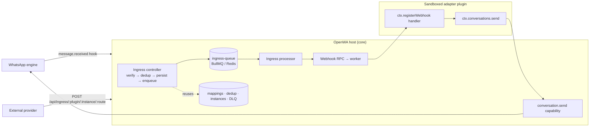

# 25 - Integration Fabric

> **Status:** P0 substrate merged as an internal foundation. This document describes the architecture and
> the design rationale — *why* it is built this way — not a how-to or an API reference. The public SDK
> reference and the first ready-to-use adapter arrive in later phases (see
> [15 - Project Roadmap](./15-project-roadmap.md)).

## 25.1 What it is

The **Integration Fabric** is a core substrate that lets sandboxed marketplace plugins implement
bidirectional integrations with external systems — helpdesk agent inboxes, chatbot flow builders, CRMs —
**without running their own server**. A third party ships an adapter as a normal marketplace plugin,
declares its needs in the manifest, and never binds a port, never touches Redis or the queue, and never
re-implements signature verification, deduplication, ordering, or delivery.

It is the inbound counterpart to the existing plugin capability surface. Today a sandboxed plugin is
outbound-only: it can send messages, read engine state, use per-plugin storage, and make SSRF-guarded
HTTP calls (`ctx.net.fetch`). What it **cannot** do is receive an inbound external HTTP request — and a
real bidirectional integration needs exactly that: an agent replies in an external inbox, the external
system fires a webhook, and something must receive it and relay the reply to WhatsApp.

The core owns ingress, verification, dedup, ordering, delivery, the dead-letter queue, secret storage,
and the identity-mapping table. The adapter owns only provider-specific logic (API calls, HMAC recompute
for exotic schemes, handover heuristics). Plugins consume the substrate through a **stable, versioned
public contract — Integration SDK v1** — because the contract, not any single adapter, is the product.

## 25.2 Design principle: one new primitive, everything else a clone

The overriding goal is to preserve the untrusted-worker safety invariants *by construction*. OpenWA
plugins run in a capability-gated worker thread with no ambient host access (see
[23 - Plugin Sandboxing](./23-plugin-sandboxing.md)). Every host↔worker message is a serializable POJO
across a `structuredClone` boundary; host-initiated calls fail open on a timeout and drain on a worker
crash; permissions are manifest-static and cannot be widened by configuration; session scope is enforced
host-side.

Rather than invent new machinery that would have to re-earn those properties, the Integration Fabric is
**~90% a faithful clone of seams OpenWA already ships**:

| Concern | Cloned from |
| ------- | ----------- |
| Host→worker dispatch with fail-open timeout + crash-drain | the existing hook bridge |
| Worker→host capability calls | the existing capability router |
| Durable delivery with retry + dead-letter | the outbound webhook queue and DLQ |
| Identity mapping table (no foreign key, last-write-wins) | the LID↔phone mapping table |
| Inbound deduplication (insert-or-skip on a unique key) | the inbound-message dedup oracle |
| SSRF-guarded egress | `ctx.net.fetch` (reused verbatim) |
| Secret masking on read | the plugin config redaction utility |

Exactly **one** genuinely new primitive exists: a host→worker RPC that returns an **HTTP status + body**
from a sandboxed worker — inbound webhook ingress. It is modelled line-for-line on the hook bridge so its
correctness properties (its own pending map, a fail-open timeout, and a drain in the worker-exit handler)
come for free. If a worker crashes mid-request, the pending ingress call resolves to a `502` instead of
hanging the HTTP request forever.

## 25.3 Architecture

The topology is intentionally two-tier (an n8n-style queue mode): an **ingress tier** (the public
controller: authenticate → normalize → persist → enqueue → fast `202`) decoupled by a durable queue from
a **dispatch tier** (the processor that runs the plugin). A provider spike, a slow adapter, or a wedged
plugin never loses events; the tiers scale independently with backpressure.

Alongside this async pipeline, a route may additionally declare a `response` contract — host-side
`preflight` checks and a declarative `ack` — that shapes the synchronous HTTP response the provider sees
**without** altering the dispatch model. The plugin still always runs async (enqueued, full DLQ/retry);
`response` only controls what the provider receives back on the request socket. See §25.4 and §25.8.

## 25.4 Core components

- **Ingress RPC** — the one new primitive. Delivers a verified inbound request into the worker and returns
  its HTTP result. The worker claims routes with `ctx.registerWebhook(route, handler)`.
- **Ingress controller** — a `@Public` endpoint (`POST|GET /api/ingress/:pluginId/:instanceId/:route`).
  It is public to the API-key guard because an external provider cannot present the gateway's API key, so
  it self-validates (see §25.6). It never runs the plugin inline — providers enforce short acknowledgement
  deadlines, so the controller fast-acks and defers the work to the queue. A route may additionally
  declare a host-side `response` contract that shapes that synchronous reply without making the plugin
  inline. Its `preflight` checks (today: `session-alive`) run **after** signature verification and
  **before** the dedup persist — returning `503` only for a definitively-dead concrete-scoped WhatsApp
  session (no live engine or `FAILED`); recoverable statuses and `READY` pass through to a normal
  `202`+enqueue so the worker can still fail fast and the dedup row still holds the delivery. A declared
  `ack` (`status`/`body`/`headers`) replaces the default `202 accepted`. For a route declaring `response`,
  the ack is returned without awaiting enqueue so a queue-disabled deployment cannot block the provider's
  deadline; the dedup row already persisted is the durability handle. A route with no `response` is
  byte-identical to today's default fast-ack.
- **Plugin instance** — a first-class `instanceId` namespaced under a `pluginId`. One adapter can back
  many instances (for example, one external account per WhatsApp number). Each instance owns a host-minted
  ingress secret, a resolved session scope, and a config slice. It is a serializable field threaded
  through payloads and rows — **not** a separate worker; there is still one worker per plugin.
- **`conversation.send` capability** — a normalized outbound send authored by the plugin and translated
  host-side to the message service, so persistence and the message hook chain are preserved. It is gated
  by a `conversation:send` permission and the instance's session scope.
- **Identity, dedup, and DLQ tables** — see §25.5.
- **Ingress queue** — a durable BullMQ queue that is a *sibling* of the outbound webhook queue (its own
  worker, not the reordering webhook worker), with exponential-backoff retries and a dead-letter row on
  the final attempt.

## 25.5 Data model

Four tables live on the data connection, each created by a hand-authored dual-dialect migration
(SQLite and PostgreSQL):

- **`plugin_instances`** — one configured instance of an adapter: its host-minted secret (masked on read),
  resolved session scope, and config.
- **`conversation_mappings`** — the WhatsApp-chat ↔ external-conversation identity map, indexed in both
  directions, plus a `handoverState` column (`bot | human | closed`) the core reads before dispatching so
  a human-handled conversation deterministically stops the bot. `sessionId` is non-foreign-key provenance
  because a mapping outlives a session.
- **`ingress_events`** — the persist-before-acknowledge row and the inbound deduplication oracle
  (`UNIQUE(instanceId, providerDeliveryId)`, insert-or-skip).
- **`integration_delivery_failures`** — a dead-letter record of last resort for both directions, with a
  redrive path (added in P1).

## 25.6 Security model

- **Authentication inversion.** A provider webhook cannot carry an OpenWA API key, so ingress is public to
  the API-key guard but validates a **per-instance HMAC (or shared secret)** over the **raw** request
  bytes with a constant-time comparison. The raw body is preserved by a verify callback on the body parser
  because a re-serialized payload is not byte-identical to what the provider signed. The global rate-limit
  guard still applies, and the payload is intentionally not bound to a DTO so strict validation cannot
  reject unknown provider fields.
- **Replay and duplication.** A signed-timestamp tolerance rejects stale deliveries, and
  `(instanceId, providerDeliveryId)` deduplication plus a queue job id keyed on the delivery id collapses
  at-least-once delivery to exactly-once processing.
- **Tenancy scoping.** Every ingress artifact — secret, dedup store, ordering lane, dead-letter row — is
  partitioned by instance, and downstream capability calls carry the instance's resolved session scope, so
  a cross-tenant send is blocked host-side.
- **Fail-closed by construction.** A missing, wrong, or stale signature, or an empty raw body, all reject.
  The only unconditional-accept path is an explicit `scheme: "none"` an adapter must declare in its
  manifest.
- **Egress.** The only outbound path remains the existing SSRF-guarded `ctx.net.fetch`, scoped to the
  manifest's allowed hosts.
- **Re-entrancy.** A reply issued *inside* an ingress handler seeds the in-flight hook set, so an adapter's
  own outbound message hook cannot echo-loop the reply back out to the external system.

## 25.7 Scale and durability

Persist-before-acknowledge; at-least-once collapsed to exactly-once via deduplication and the queue job
id; best-effort per-conversation ordering via an advisory lock (P1) — strict FIFO is not preserved across a queue retry or a redrive (inbound arrives over unordered HTTP and is a reconcile trigger, not an ordered source of truth); per-instance fairness via a token bucket
that sheds a noisy tenant at the edge (P1); a dead-letter record with a redrive endpoint (P1). All shared
state lives in Redis and PostgreSQL rather than in per-plugin files or the in-memory hook bus, so the
design can scale to multiple nodes later without re-plumbing (the initial implementation runs on a single
node). When the queue is disabled, ingress degrades to inline dispatch after persisting, mirroring the
existing outbound webhook fallback.

## 25.8 The Integration SDK (v1)

The stable surface untrusted adapters consume. A plugin declares `sdkVersion: "1"` and an `ingress`
descriptor (the route, its signature scheme, replay tolerance, dedup header, and an optional verification
handshake) in its manifest, and requests the `webhook:ingress` and `conversation:send` permissions. The
host refuses to route ingress to a plugin whose declared **major** differs from the host's supported
major, and the surface is **additive-only** within a major. The worker-facing API centres on
`ctx.registerWebhook(...)` (claim an inbound route), `ctx.conversations.send(...)` (normalized reply), and
per-instance mapping and handover helpers.

The `signature.scheme` field enumerates `hmac-sha256` (HMAC over a `contentTemplate`), `shared-secret`
(constant-time header compare), `standard-webhooks`, and `none` (unauthenticated — see §25.6). The
`standard-webhooks` scheme verifies a [Standard Webhooks](https://github.com/standard-webhooks/standard-webhooks)
payload host-side — Supabase Auth's Send-SMS hook and any Svix-routed provider speak it natively. Its wire
format is fixed by the spec (the `webhook-id` / `webhook-timestamp` / `webhook-signature` header triple,
signed over `${id}.${timestamp}.${rawBody}`), so only `toleranceSec` (default 300) and `dedupHeader`
apply; `header`, `contentTemplate`, `encoding`, `prefix`, and `timestampHeader` are ignored, and the
operator pastes the provider's Svix secret (`v1,whsec_<base64>`) as the instance secret. It is the
recommended scheme for Standard-Webhooks providers: because the `session-alive` preflight (§25.4) runs
*after* signature verification, an unauthenticated caller can no longer use that preflight as a liveness
oracle on a route that previously declared `scheme: "none"`. The existing `hmac-sha256`/`shared-secret`/
`none` behavior is unchanged.

Within major 1 the surface grows additively. A route's optional `response` contract — `preflight[]`
(host-side checks such as `session-alive`, evaluated after signature verify), `ack{}` (`status`/`body`/
`headers`, rendered host-side with `{rawBody}`/`{timestamp}`/`{id}` templates from the verified request),
and an advisory `deadlineMs` — lets an adapter shape the synchronous HTTP response the provider sees; the
plugin still always runs async, and a route with no `response` is byte-identical to today's default
fast-ack. The `mode: 'sync-reply'` value is **deprecated** in favor of `response`: it was inert dead code
that was never wired to the HTTP response (the pipeline is always async + fast-ack), and it is kept in the
`mode` union only to preserve SDK v1 additive-only compatibility — do not remove it within major 1, and do
not rely on it at runtime.

The full SDK reference — every manifest field, the envelope schema, the lifecycle, and the golden
compatibility fixtures — is published alongside the first adapter, so it documents a contract that can
actually be exercised end to end. Until then this document and the manifest types are the source of truth.

## 25.9 Phasing and status

See [15 - Project Roadmap](./15-project-roadmap.md) for the full phase table. In brief: **P0** (this
substrate) is merged as an internal foundation; **P1** adds scale-correctness (per-conversation ordering,
per-instance fairness, DLQ redrive, handover); **P2** adds operator provisioning and ships the first
adapter as a marketplace plugin; **P3** ships a second adapter; **P4** covers developer experience (SDK
reference, compatibility suite, secret rotation, multi-node routing).

> **P0 and P1 are not a user-facing feature yet.** The ingress flow requires an operator provisioning step
> (minting a plugin instance and its secret) that lands in P2; until then it is reachable only by direct
> configuration.

---

> See also: [03 - System Architecture](03-system-architecture.md),
> [04 - Security Design](04-security-design.md),
> [19 - Plugin Architecture](19-plugin-architecture.md),
> [23 - Plugin Sandboxing](23-plugin-sandboxing.md),
> [15 - Project Roadmap](15-project-roadmap.md).
